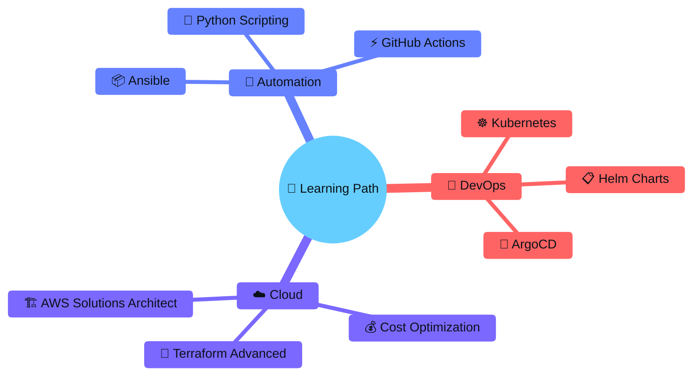

<div align="center">

<!-- Animated Header -->


<!-- Profile Banner -->


<!-- Social Badges -->
<p align="center">
  <a href="https://www.linkedin.com/in/narendra-geddam-699211213/">
    
  </a>
  <a href="https://github.com/Narendra-Geddam">
    
  </a>
  <a href="mailto:narendrageddam7@gmail.com">
    
  </a>
  <a href="https://github.com/Narendra-Geddam?tab=followers">
    
  </a>
</p>

<!-- Profile Views Counter -->


<br/><br/>

<!-- Animated Divider -->


</div>

## 🚀 About Me

<table>
<tr>
<td width="60%">

```yaml
name: Narendra Geddam
role: DevOps Engineer & Frontend Developer
location: India
education: BCA - Sri HR Sriramulu Memorial College

interests:
  - Linux & System Administration
  - Cloud Infrastructure & Automation
  - CI/CD Pipeline Development
  - Container Orchestration
  - Frontend Development

currently_learning:
  - Advanced Kubernetes
  - Cloud Native Technologies
  - Infrastructure as Code

motto: "Code, Learn, Automate, Repeat. 🚀"
```

</td>
<td width="40%" align="center">


</td>
</tr>
</table>

<!-- Animated Divider -->


## 🛠️ Tech Stack & Tools

### 💻 Programming Languages
<p align="center">
  
</p>

### ⚙️ DevOps & Cloud
<p align="center">
  
</p>

### 🐧 Operating Systems & Tools
<p align="center">
  
</p>

<!-- Tech Stack Badges Alternative -->
<details>
<summary>🔍 Click to see detailed badges</summary>
<br/>

**Languages & Scripting:**


**DevOps Tools:**


**Systems:**


</details>

<!-- Animated Divider -->


## 📂 Featured Projects

<div align="center">

<table>
<tr>
<td width="50%">

### 🔧 Linux Automation Scripts


> Automated system administration tasks including process handling, cron jobs, and system monitoring

**Key Features:**
- 🔄 Automated backup scripts
- 📊 System resource monitoring
- ⚡ Process automation & management
- 🔔 Alert notifications

[📁 View Repository](https://github.com/Narendra-Geddam/Automation-Scripts) · [📖 Documentation](https://github.com/Narendra-Geddam/Automation-Scripts#readme)

</td>
<td width="50%">

### 🔊 Text-to-Speech App

> Modern application for converting text to natural speech

**Key Features:**
- 🎨 Responsive UI design
- 🔊 Multiple voice options
- ⚡ Real-time text processing
- 📱 Mobile-friendly interface

[📁 View Repository](https://github.com/Narendra-Geddam/Audiobook-creater) · [🌐 Live Demo](https://github.com/Narendra-Geddam/Audiobook-creater)

</td>
</tr>
<tr>
<td width="50%">

### ⚙️ DevOps CI/CD Pipeline


> Complete CI/CD pipeline setup with Jenkins, Docker, and automated deployments

**Key Features:**
- 🔄 Automated builds & tests
- 🐳 Docker containerization
- ☸️ Kubernetes deployment
- 📈 Pipeline monitoring

[📁 View Repository](https://github.com/Narendra-Geddam/jenkins-DevOps) · [📖 Documentation](https://github.com/Narendra-Geddam/jenkins-DevOps#readme)

</td>
<td width="50%">

### ☁️ AWS Infrastructure


> Infrastructure as Code projects using Terraform and AWS services

**Key Features:**
- 🏗️ Terraform IaC templates
- 🌐 VPC & Networking setup
- 🔒 Security group configurations
- 📊 CloudWatch monitoring

[📁 View Repository](https://github.com/Narendra-Geddam/eks-terraform) · [📖 Documentation](https://github.com/Narendra-Geddam/eks-terraform#readme)

</td>
</tr>
</table>

</div>

<!-- Animated Divider -->


## 📊 GitHub Analytics

<div align="center">

<!-- GitHub Stats Cards -->
<table>
<tr>
<td width="50%" align="center">


</td>
<td width="50%" align="center">


</td>
</tr>
</table>

<!-- GitHub Streak Stats -->


<br/><br/>

<!-- Contribution Graph -->


<br/><br/>

<!-- GitHub Trophies -->


</div>

<!-- Animated Divider -->


## 🎯 Current Focus



<!-- Animated Divider -->


## 🤝 Let's Connect!

<div align="center">

<p align="center">
  <a href="https://www.linkedin.com/in/narendra-geddam-699211213/">
    
  </a>
  &nbsp;
  <a href="mailto:narendrageddam7@gmail.com">
    
  </a>
  &nbsp;
  <a href="https://github.com/Narendra-Geddam">
    
  </a>
</p>

<br/>

<!-- Quote -->


<br/><br/>

<!-- Footer -->


**⭐ Star my repositories if you find them helpful!**

**💡 Open to collaboration and new opportunities!**

</div>
